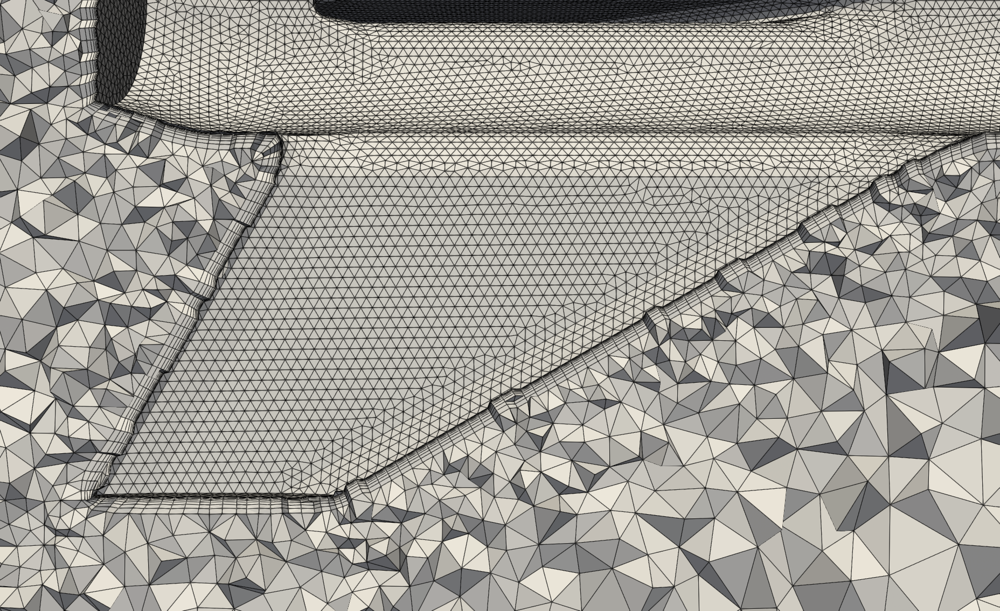
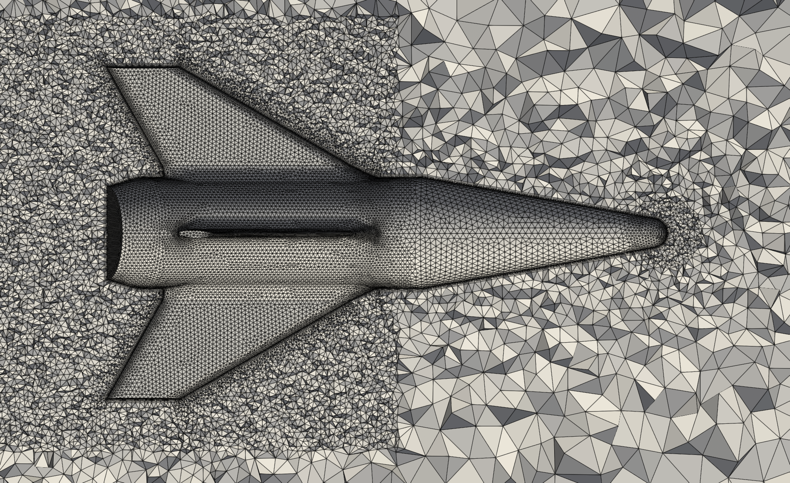

# cfd-meshman
3D unstructured mesh manufacturing/manipulation for a (currently) GMSH+NASA_mesh_tools viscous CFD meshing stack:
- [GMSH](https://gmsh.info/) for surface meshing
- [NASA Mesh_Tools](https://software.nasa.gov/software/MSC-26648-1) for extruded boundary layer meshes
- [GMSH](https://gmsh.info/) for tetrahedral "farfield" volume meshing

cfd-meshman consists of the python tools required to get these to talk to each other, to build combined extruded-boundary-layer + farfield volume meshes. 

The main components/functionalities are:
- **Umesh**: a "pythonic" representation of unstructured meshes, that primarily facilitates the conversion of GMSH v2.2 .msh files to/from .ugrid
- **gen_blmesh.py**: given a surface mesh, uses Mesh_Tools to extrude a boundary layer mesh
- **gen_farfield.py**: given a boundary layer mesh from above, uses GMSH to generate the tetrahedral farfield from the outermost-surface of the boundary layer to the domain extents, and stitches everything together into a single domain.

This workflow is by no means perfect. It is a WIP and thus has limitations and can be brittle; but is decent enough for my usage. 

**It is also 100% free** (assuming you are eligible for access to Mesh_Tools through the [NASA Software Catalog/Technology Transfer Program](https://software.nasa.gov/). 

_I welcome any help and/or feedback :)_

> [!CAUTION]
> ADD LINK TO BLOG POST

# Limitations
- cfd-meshman only supports triangular surfaces meshes right now. Going to fix shortly. All the other tools should be able to handle quads fine.
- no support for symmetry planes yet, although Mesh_Tools, GMSH should be able to support them.

# Examples

## example_simple.py
Just showing the simplest implementation of "extrude boundary layer and generate farfield":
| **Near** | **Detail** | **Far** |
| ----------- | ----------- | ----------- |
|  |  |  |

## example_advanced.py
Showing the use of GMSH size fields to do things like refine the wake or increase resolution at nose tip (note that size fields get applied congrously between the surface and volume meshes):
| **Near** |
| ----------- |
|  | 

# Installation
I have only used this on Linux. If you're on Windows i'd reccomend using WSL2.

The main dependency here that requires instruction is NASA Mesh_Tools. I reccomend getting this installed and verifying it is working before playing around with this repo, in the order have outlined below.

> [!NOTE]
> If you are having any issues with installation things, please feel free to reach out to me.

## [NASA Mesh_Tools](https://software.nasa.gov/software/MSC-26648-1)

> [!CAUTION]
> DO NOT USE VERSION 1.2. USE VERSION 1.1 (all versions should be included in the ZIP from the NASA request). The "extrude" functionality of v1.2 did not work for me out of the box, and requires code modifications to make it not segfault. Just use 1.1.

You have to request this from the NASA Software Catalog. See links above.

Unfortunately, this one is a bit complicated to install, but if you follow the README included with it, it should get you up and running. It does requires you to build an older version of [VTK](https://docs.vtk.org/en/latest/build_instructions/index.html) with certain flags enabled, which is inconvenient at best, and can be really horrifying at its worst. 

I just used the default Anaconda install (I used miniconda personally, shouldn't really matter though). 

Make sure to add the path to the Mesh_Tools 'extrude' binary (mesh_tools-v1.1.0/bin/extrude) to the system PATH.

To confirm you've installed this correctly, try running the extrude_for_char and extrude_shock examples and see if it breaks.

## cfd-meshman
1. Clone this repo
2. (reccomended) create a virtual environment
3. cd into repo, `pip install -r requirements.txt`
4. Once installed, see if the simple cfd-meshman example above works. If any of the examples don't work, you're more than welcome to bug me.

> [!NOTE]
> The [current implementation](https://github.com/elliottmckee/cfd-meshman/blob/main/src/gen_blmesh.py) relies on the mesh_convert.py functionality included in Mesh_Tools. This is currently invoked using ['conda run'](https://docs.conda.io/projects/conda/en/latest/commands/run.html) functionality. If you have installed Mesh_Tools using conda above, you _shouldn't_ have any issue, **assuming** that the mesh-tools conda environement is named 'mesh_tools_p3p7'.

# Usage
- See examples. 
- If you need to modify the Mesh_Tools extrusion parameters (this is likely, it can be a bit finicky about these), modify [extrude_config.py](https://github.com/elliottmckee/cfd-meshman/blob/main/src/extrude_config.py).

> [!CAUTION]
> ADD QUICK NOTES ON HOW TO GET MAPBC FOR FUN3D

# Other useful things
- [meshio](https://github.com/nschloe/meshio) _can_ be useful for translating meshes into other formats. This is probably better than my own custom .msh<->.ugrid conversion functions, but I just couldn't get it to do what I needed it to at the time.
- [Paraview](https://www.paraview.org/) is what I use for viewing meshes once completed (after using meshio to convert from .msh to .vtk, for example)

